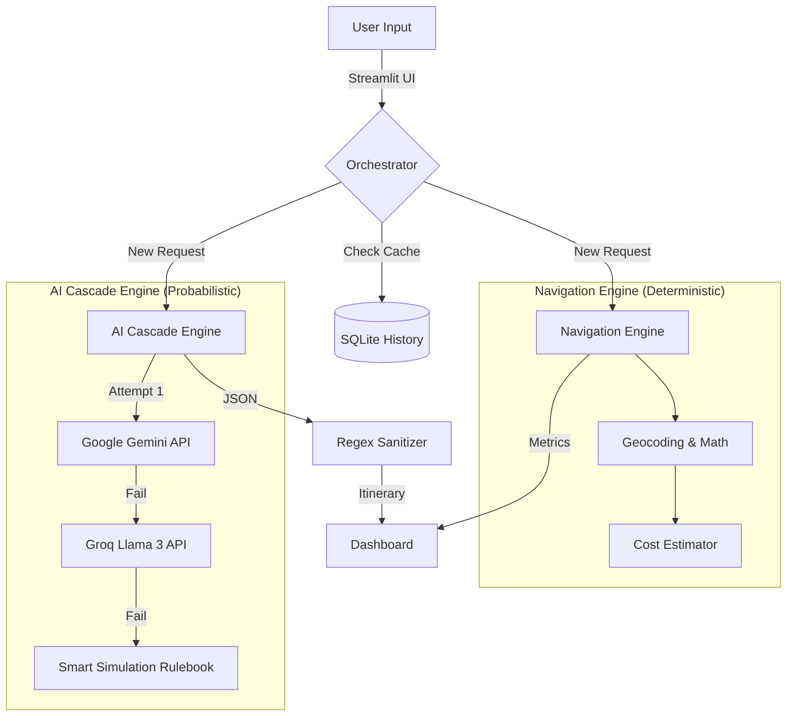

# ✈️ Wanderlust AI: Travel Itinerary Planner


> **Spellbound Coders Cup 2025 Submission** > *BE YOU*

---

## Table of Contents
- [Problem Statement](#-problem-statement)
- [Solution Overview](#-solution-overview)
- [Key Features](#-key-features)
- [System Architecture](#-system-architecture)
- [Tech Stack](#-tech-stack)
- [Installation & Setup](#-installation--setup)
- [Project Structure](#-project-structure)
- [Deployment](#-deployment)

---

## Problem Statement
Planning a trip is overwhelming. Travelers juggle between blogs, maps, and booking sites to find:
1.  **What to do?** (Personalized activities)
2.  **How to get there?** (Logistics & Route)
3.  **How much will it cost?** (Budgeting)

Most tools are either too generic or require manual piecing together. There is no single "Smart Agent" that handles the entire lifecycle from **Ideation** to **Logistics**.

---

## Solution Overview
**Wanderlust AI** is a resilient, production-grade travel planner. It combines **Generative AI** (Creative planning) with **Deterministic Math** (Logistics & Costs) to create a fail-proof itinerary.

Unlike standard wrappers, it features a **Multi-Layer AI Engine**:
1.  **Primary:** Google Gemini 1.5/2.0 Flash.
2.  **Secondary:** Groq (Llama-3-70b) for high-speed backup.
3.  **Tertiary:** A Mathematical Simulation Engine that generates valid itineraries even if all AI APIs are offline.

---

## Key Features
* **Hybrid Intelligence:** Switches seamlessly between Gemini and Llama 3 based on availability.
* **Offline Resilience:** "Smart Fallback" engine guarantees a schedule is always generated.
* **Real-Time Logistics:** Calculates flight, train, and car costs using geodesic math—no external API dependencies.
* **Dynamic Budgeting:** Auto-detects budget style (Backpacker vs. Luxury) and tracks spending in real-time.
* **Interactive Mapping:** Embeds live Google Maps with waypoints for every single trip.

---

## System Architecture



## Tech Stack
Frontend: Streamlit (Python)

AI Core: Google Generative AI (Gemini 1.5 Flash), Groq (Llama 3)

Logistics: Geopy (Geodesic distance calculation), Folium (Mapping)

Database: SQLite (Zero-config persistence)

Deployment: Streamlit Community Cloud / Docker ready

## Installation & Setup
We support three installation methods to ensure cross-platform compatibility.

Prerequisites
```
Python 3.10+
Git
```

Method 1: Standard Python (Recommended)
Bash

1. Clone the repository
```
git clone [https://github.com/your-username/wanderlust-ai.git](https://github.com/your-username/wanderlust-ai.git)
cd wanderlust-ai
```

3. Create Virtual Environment
```
python -m venv venv
source venv/bin/activate  # Windows: venv\Scripts\activate
```

5. Install Dependencies
```
pip install -r requirements.txt
```

7. Run App
```
streamlit run app.py
```

Method 2: Conda
Bash
```
conda env create -f environment.yml
conda activate wanderlust-ai
streamlit run app.py
```

Method 3: NPM (Task Runner)
Bash
```
npm run setup  # Installs python deps
npm start      # Launches app
```

## Project Structure
```
wanderlust-ai/
├── .streamlit/          # App config & Secrets
│   └── config.toml      # UI Customization
├── src/
│   ├── ai_engine.py     # Multi-model Cascade Logic
│   ├── navigation.py    # Math-based Cost & Distance
│   ├── db.py            # SQLite Authentication & History
│   └── static_data.py   # Offline Knowledge Base
├── app.py               # Main Application Router
├── requirements.txt     # Python Dependencies
├── environment.yml      # Conda Environment
├── package.json         # NPM Scripts
└── README.md            # Documentation
```
## Screenshots


## Built with ❤️ by Be You
